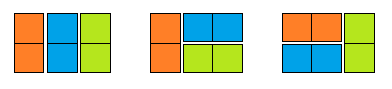

# 1-3: Dlaždice

**Assignment:**
>Pred novým školským rokom u Jakubka v škole renovovali chodbu. Chodba je tvaru N x 2 políčok a je celá pokrytá dlaždicami veľkosti 2 políčka, dlaždica môže byť na chodbe umiestnená vodorovne alebo zvislo. Existujú rôzne spôsoby pokrytia celej chodby dlaždicami veľkosti 2.

>Napr. chodbu veľkosti 3x2 je možné pokryť tromi rôznymi spôsobmi:

>Napíšte algoritmus, ktorý určí všetky rôzne možnosti pokrytia celej chodby dlaždicami veľkosti 2.
Štandardný vstup obsahuje niekoľko riadkov, na každom z nich bude jedno celé číslo N (N < 25). Pre každý riadok na vstupe postupne vypíšte na štandardný výstup počet rôznych spôsobov a na nasledujúcich riadkoch výpíšte všetky rôzne spôsoby pokrytia chodby N x 2 parketami veľkosti 2. Pre výpis použite znak = (ASCII kód 61) pre dve parkety nad sebou a znak | (ASCII kód 124) pre zvislú parketu. Možné spôsoby pokrytia vypíšte v usporiadanom poradí tak, že znak = (61) je pred znakom | (124).

>**Ukážka vstupu:** \
>4

>**Výstup pre ukážkový vstup:** \
>5 \
>== \
>=|| \
>|=| \
>||= \
>||||
